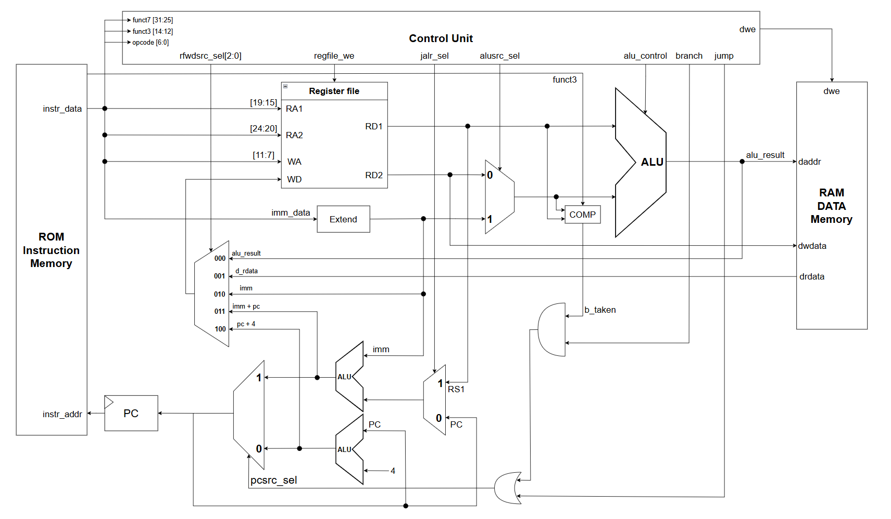
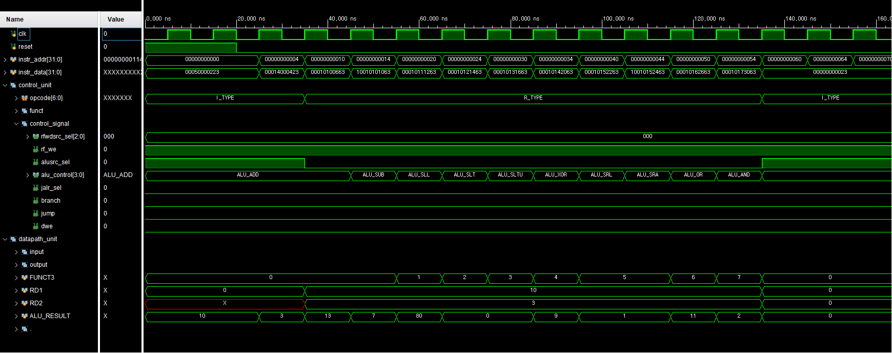
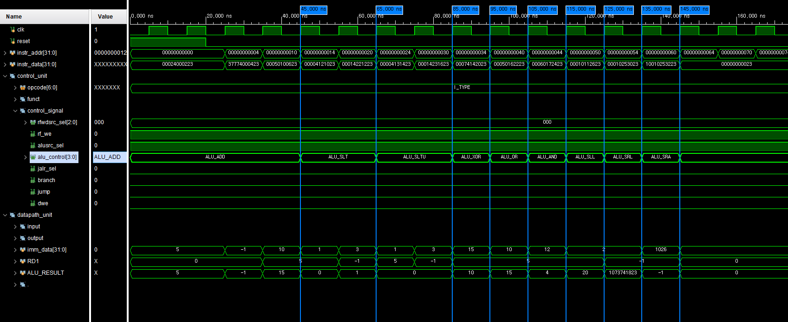

# RV32I Single-Cycle Core

## Overview

RV32I ISA를 지원하는 Single-Cycle Processor를 SystemVerilog로 구현하였다.

현재 구현된 명령어에 대해 시뮬레이션을 수행하며 기능을 검증하고 있다.

---

# Block Diagram

RV32I Single-Cycle Processor의 전체 데이터패스와 제어 구조는 아래와 같다.



---

# Simulation

## R-Type Instruction Test

### Test Objective

R-Type 명령어의 ALU 제어 신호와 연산 결과가 RISC-V 명세와 일치하는지 검증한다.

---

### Test Program

```assembly
00A00093    // addi x1, x0, 10      ; x1 = 10
00300113    // addi x2, x0, 3       ; x2 = 3

002081B3    // add  x3, x1, x2
40208233    // sub  x4, x1, x2
002092B3    // sll  x5, x1, x2
0020A333    // slt  x6, x1, x2
0020B3B3    // sltu x7, x1, x2
0020C433    // xor  x8, x1, x2
0020D4B3    // srl  x9, x1, x2
4020D533    // sra  x10,x1,x2
0020E5B3    // or   x11,x1,x2
0020F633    // and  x12,x1,x2

00000013    // nop
00000013    // nop
00000013    // nop
```

---

### Expected Result

| Instruction | Operand | Expected Result |
|-------------|---------|----------------:|
| ADD  | 10 + 3 | 13 |
| SUB  | 10 - 3 | 7 |
| SLL  | 10 << 3 | 80 |
| SLT  | 10 < 3 | 0 |
| SLTU | 10 < 3 (unsigned) | 0 |
| XOR  | 10 ^ 3 | 9 |
| SRL  | 10 >> 3 | 1 |
| SRA  | 10 >>> 3 | 1 |
| OR   | 10 \| 3 | 11 |
| AND  | 10 & 3 | 2 |

---

### Simulation Result

> `ALU_CONTROL` 신호가 각 R-Type 명령어에 맞게 정상적으로 변경되며, `ALU_RESULT`가 기대한 결과와 일치함을 확인하였다.



---

### Verification Summary

| Instruction | Result |
|-------------|:------:|
| ADD | ✅ Pass |
| SUB | ✅ Pass |
| SLL | ✅ Pass |
| SLT | ✅ Pass |
| SLTU | ✅ Pass |
| XOR | ✅ Pass |
| SRL | ✅ Pass |
| SRA | ✅ Pass |
| OR | ✅ Pass |
| AND | ✅ Pass |

---

## I-Type Instruction Test

### Test Objective

I-Type ALU Immediate 명령어의 즉시값 처리(Sign Extension), 비교 연산(Signed/Unsigned), 논리 연산 및 Shift 연산이 RISC-V 명세와 일치하는지 검증한다.

---

### Test Program

```assembly
00500093    // addi  x1, x0, 5       ; x1 = 5
FFF00113    // addi  x2, x0, -1      ; x2 = -1 (0xFFFFFFFF)

00A08193    // addi  x3, x1, 10      ; x3 = 15

0010A213    // slti  x4, x1, 1       ; x4 = (5 < 1) ? 1 : 0 = 0
00312293    // slti  x5, x2, 3       ; x5 = (-1 < 3) ? 1 : 0 = 1

0010B313    // sltiu x6, x1, 1       ; x6 = (5 < 1) ? 1 : 0 = 0
00313393    // sltiu x7, x2, 3       ; x7 = (0xFFFFFFFF < 3) ? 1 : 0 = 0

00F0C413    // xori  x8, x1, 15      ; x8 = 5 ^ 15 = 10
00A0E493    // ori   x9, x1, 10      ; x9 = 5 | 10 = 15
00C0F513    // andi  x10,x1, 12      ; x10 = 5 & 12 = 4

00209593    // slli  x11,x1, 2       ; x11 = 5 << 2 = 20
00215613    // srli  x12,x2, 2       ; x12 = 0xFFFFFFFF >> 2 = 0x3FFFFFFF
40215693    // srai  x13,x2, 2       ; x13 = 0xFFFFFFFF >>> 2 = 0xFFFFFFFF

00000013    // nop
00000013    // nop
00000013    // nop
```

---

### Expected Result

| Instruction | Operand | Expected Result |
|-------------|---------|----------------:|
| ADDI  | 5 + 10 | 15 |
| SLTI  | 5 < 1 | 0 |
| SLTI  | -1 < 3 | 1 |
| SLTIU | 5 < 1 (unsigned) | 0 |
| SLTIU | 0xFFFFFFFF < 3 (unsigned) | 0 |
| XORI  | 5 ^ 15 | 10 |
| ORI   | 5 \| 10 | 15 |
| ANDI  | 5 & 12 | 4 |
| SLLI  | 5 << 2 | 20 |
| SRLI  | 0xFFFFFFFF >> 2 | 0x3FFFFFFF |
| SRAI  | 0xFFFFFFFF >>> 2 | 0xFFFFFFFF |

---

### Simulation Result

> `ALU_CONTROL` 신호가 각 I-Type 명령어에 맞게 정상적으로 변경되며, 즉시값 처리(Sign Extension), Signed/Unsigned 비교, Shift 연산 및 `ALU_RESULT`가 기대한 결과와 일치함을 확인하였다.



---

### Verification Summary

| Instruction | Result |
|-------------|:------:|
| ADDI | ✅ Pass |
| SLTI | ✅ Pass |
| SLTIU | ✅ Pass |
| XORI | ✅ Pass |
| ORI | ✅ Pass |
| ANDI | ✅ Pass |
| SLLI | ✅ Pass |
| SRLI | ✅ Pass |
| SRAI | ✅ Pass |

---

## Next Verification

- [x] R-Type
- [x] I-Type (ALU Immediate)
- [ ] Load
- [ ] Store
- [ ] Branch
- [ ] JAL
- [ ] JALR
- [ ] LUI
- [ ] AUIPC
