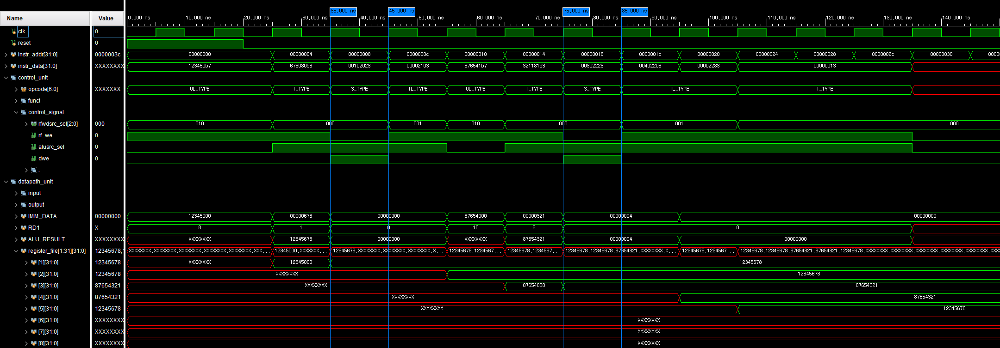
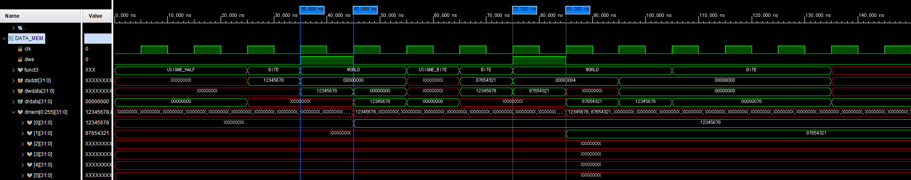

# RV32I Single-Cycle Core

## Overview

RV32I ISA를 지원하는 Single-Cycle Processor를 SystemVerilog로 구현하였다.

현재 구현된 명령어에 대해 시뮬레이션을 수행하며 기능을 검증하고 있다.

---

# Block Diagram

RV32I Single-Cycle Processor의 전체 데이터패스와 제어 구조는 아래와 같다.


---

# Simulation

## R-Type Instruction Test

### Test Objective

R-Type 명령어의 ALU 제어 신호와 연산 결과가 RISC-V 명세와 일치하는지 검증한다.

---

### Test Program

```assembly
00A00093    // addi x1, x0, 10      ; x1 = 10
00300113    // addi x2, x0, 3       ; x2 = 3

002081B3    // add  x3, x1, x2
40208233    // sub  x4, x1, x2
002092B3    // sll  x5, x1, x2
0020A333    // slt  x6, x1, x2
0020B3B3    // sltu x7, x1, x2
0020C433    // xor  x8, x1, x2
0020D4B3    // srl  x9, x1, x2
4020D533    // sra  x10,x1,x2
0020E5B3    // or   x11,x1,x2
0020F633    // and  x12,x1,x2

00000013    // nop
00000013    // nop
00000013    // nop
```

---

### Expected Result

| Instruction | Operand | Expected Result |
|-------------|---------|----------------:|
| ADD  | 10 + 3 | 13 |
| SUB  | 10 - 3 | 7 |
| SLL  | 10 << 3 | 80 |
| SLT  | 10 < 3 | 0 |
| SLTU | 10 < 3 (unsigned) | 0 |
| XOR  | 10 ^ 3 | 9 |
| SRL  | 10 >> 3 | 1 |
| SRA  | 10 >>> 3 | 1 |
| OR   | 10 \| 3 | 11 |
| AND  | 10 & 3 | 2 |

---

### Simulation Result

> `ALU_CONTROL` 신호가 각 R-Type 명령어에 맞게 정상적으로 변경되며, `ALU_RESULT`가 기대한 결과와 일치함을 확인하였다.


---

### Verification Summary

| Instruction | Result |
|-------------|:------:|
| ADD | ✅ Pass |
| SUB | ✅ Pass |
| SLL | ✅ Pass |
| SLT | ✅ Pass |
| SLTU | ✅ Pass |
| XOR | ✅ Pass |
| SRL | ✅ Pass |
| SRA | ✅ Pass |
| OR | ✅ Pass |
| AND | ✅ Pass |

---

## I-Type Instruction Test

### Test Objective

I-Type ALU Immediate 명령어의 즉시값 처리(Sign Extension), 비교 연산(Signed/Unsigned), 논리 연산 및 Shift 연산이 RISC-V 명세와 일치하는지 검증한다.

---

### Test Program

```assembly
00500093    // addi  x1, x0, 5       ; x1 = 5
FFF00113    // addi  x2, x0, -1      ; x2 = -1 (0xFFFFFFFF)

00A08193    // addi  x3, x1, 10      ; x3 = 15

0010A213    // slti  x4, x1, 1       ; x4 = (5 < 1) ? 1 : 0 = 0
00312293    // slti  x5, x2, 3       ; x5 = (-1 < 3) ? 1 : 0 = 1

0010B313    // sltiu x6, x1, 1       ; x6 = (5 < 1) ? 1 : 0 = 0
00313393    // sltiu x7, x2, 3       ; x7 = (0xFFFFFFFF < 3) ? 1 : 0 = 0

00F0C413    // xori  x8, x1, 15      ; x8 = 5 ^ 15 = 10
00A0E493    // ori   x9, x1, 10      ; x9 = 5 | 10 = 15
00C0F513    // andi  x10,x1, 12      ; x10 = 5 & 12 = 4

00209593    // slli  x11,x1, 2       ; x11 = 5 << 2 = 20
00215613    // srli  x12,x2, 2       ; x12 = 0xFFFFFFFF >> 2 = 0x3FFFFFFF
40215693    // srai  x13,x2, 2       ; x13 = 0xFFFFFFFF >>> 2 = 0xFFFFFFFF

00000013    // nop
00000013    // nop
00000013    // nop
```

---

### Expected Result

| Instruction | Operand | Expected Result |
|-------------|---------|----------------:|
| ADDI  | 5 + 10 | 15 |
| SLTI  | 5 < 1 | 0 |
| SLTI  | -1 < 3 | 1 |
| SLTIU | 5 < 1 (unsigned) | 0 |
| SLTIU | 0xFFFFFFFF < 3 (unsigned) | 0 |
| XORI  | 5 ^ 15 | 10 |
| ORI   | 5 \| 10 | 15 |
| ANDI  | 5 & 12 | 4 |
| SLLI  | 5 << 2 | 20 |
| SRLI  | 0xFFFFFFFF >> 2 | 0x3FFFFFFF |
| SRAI  | 0xFFFFFFFF >>> 2 | 0xFFFFFFFF |

---

### Simulation Result

> `ALU_CONTROL` 신호가 각 I-Type 명령어에 맞게 정상적으로 변경되며, 즉시값 처리(Sign Extension), Signed/Unsigned 비교, Shift 연산 및 `ALU_RESULT`가 기대한 결과와 일치함을 확인하였다.


---

### Verification Summary

| Instruction | Result |
|-------------|:------:|
| ADDI | ✅ Pass |
| SLTI | ✅ Pass |
| SLTIU | ✅ Pass |
| XORI | ✅ Pass |
| ORI | ✅ Pass |
| ANDI | ✅ Pass |
| SLLI | ✅ Pass |
| SRLI | ✅ Pass |
| SRAI | ✅ Pass |

---

## Load / Store Instruction Test

Load/Store 명령어의 메모리 접근(Addressing), 데이터 저장(Store), 데이터 읽기(Load), Sign Extension 및 Zero Extension 동작이 RISC-V 명세와 일치하는지 검증한다.

---

<details>
<summary><strong>SW / LW Test</strong></summary>

<br>

#### Test Objective

`SW`(Store Word)와 `LW`(Load Word) 명령어의 메모리 읽기/쓰기 동작을 검증한다.

또한 `LUI` 명령어를 이용하여 32-bit 상수 값을 생성하고, 생성된 데이터가 메모리에 정상적으로 저장 및 복원되는지 함께 확인한다.

---

#### Test Program

```assembly
123450B7    // lui   x1, 0x12345        ; x1 = 0x12345000
67808093    // addi  x1, x1, 0x678      ; x1 = 0x12345678

00102023    // sw    x1, 0(x0)          ; mem[0] = 0x12345678
00002103    // lw    x2, 0(x0)          ; x2 = 0x12345678

876541B7    // lui   x3, 0x87654        ; x3 = 0x87654000
32118193    // addi  x3, x3, 0x321      ; x3 = 0x87654321

00302223    // sw    x3, 4(x0)          ; mem[1] = 0x87654321
00402203    // lw    x4, 4(x0)          ; x4 = 0x87654321

00002283    // lw    x5, 0(x0)          ; x5 = 0x12345678

00000013    // nop
00000013    // nop
00000013    // nop
```
---

#### Expected Result

| Instruction | Expected Result |
|-------------|----------------:|
| LUI + ADDI | x1 = 0x12345678 |
| SW | mem[0] = 0x12345678 |
| LW | x2 = 0x12345678 |
| LUI + ADDI | x3 = 0x87654321 |
| SW | mem[1] = 0x87654321 |
| LW | x4 = 0x87654321 |
| LW | x5 = 0x12345678 |

---

#### Simulation Result

> `LUI`를 이용하여 생성한 32-bit 데이터가 `SW`를 통해 메모리에 정상적으로 저장되었으며, `LW`를 통해 동일한 값이 정확하게 복원되는 것을 확인하였다. 또한 서로 다른 Word 주소에 대한 연속적인 접근 이후에도 기존 데이터가 유지되어 Word 단위 메모리 접근이 정상적으로 동작함을 확인하였다.

<p align="center">
  
  
</p>

---

#### Verification Summary

| Instruction | Result |
|-------------|:------:|
| LUI | ✅ Pass |
| SW | ✅ Pass |
| LW | ✅ Pass |
| Word Addressing | ✅ Pass |
| Consecutive Word Access | ✅ Pass |

---

</details>

<details>
<summary><strong>SH / LH / LHU Test</strong></summary>

<br>

#### Test Objective

`SH`(Store Halfword), `LH`(Load Halfword), `LHU`(Load Halfword Unsigned) 명령어의 Halfword 단위 메모리 접근(Addressing), 데이터 저장(Store), 데이터 읽기(Load), Sign Extension 및 Zero Extension 동작이 RISC-V 명세와 일치하는지 검증한다.

---

#### Test Program

```assembly
1234F0B7    // lui   x1, 0x1234F        ; x1 = 0x1234F000
67808093    // addi  x1, x1, 0x678      ; x1 = 0x1234F678

87658137    // lui   x2, 0x87658        ; x2 = 0x87658000
32110113    // addi  x2, x2, 0x321      ; x2 = 0x87658321

00101023    // sh    x1, 0(x0)          ; mem[0][15:0]  = 0xF678
00201123    // sh    x2, 2(x0)          ; mem[0][31:16] = 0x8321
                                        ; mem[0] = 0x8321F678

00001183    // lh    x3, 0(x0)          ; x3 = 0xFFFFF678
00201203    // lh    x4, 2(x0)          ; x4 = 0xFFFF8321

00005283    // lhu   x5, 0(x0)          ; x5 = 0x0000F678
00205303    // lhu   x6, 2(x0)          ; x6 = 0x00008321

00000013    // nop
00000013    // nop
00000013    // nop
```

---

#### Expected Result

| Instruction | Expected Result |
|-------------|----------------:|
| LUI + ADDI | x1 = 0x1234F678 |
| LUI + ADDI | x2 = 0x87658321 |
| SH | mem[0] = 0x8321F678 |
| LH | x3 = 0xFFFFF678 |
| LH | x4 = 0xFFFF8321 |
| LHU | x5 = 0x0000F678 |
| LHU | x6 = 0x00008321 |

---

#### Simulation Result

> `SH`를 통해 각 Halfword가 메모리의 하위 16-bit와 상위 16-bit에 정상적으로 저장되었음을 확인하였다. 또한 `LH`는 부호 비트(bit15)를 기준으로 Sign Extension을 수행하여 음수 값으로 복원되었으며, `LHU`는 동일한 데이터를 Zero Extension하여 읽어오는 것을 확인하였다. 이를 통해 Halfword 단위 메모리 접근과 Signed/Unsigned Load 동작이 모두 정상적으로 수행됨을 검증하였다.

<p align="center">
  
</p>

---

#### Verification Summary

| Instruction | Result |
|-------------|:------:|
| SH | ✅ Pass |
| LH | ✅ Pass |
| LHU | ✅ Pass |
| Halfword Addressing | ✅ Pass |
| Sign Extension | ✅ Pass |
| Zero Extension | ✅ Pass |

---

</details>

<details>
<summary><strong>SB / LB / LBU Test</strong></summary>

<br>

#### Test Objective

`SB`(Store Byte), `LB`(Load Byte), `LBU`(Load Byte Unsigned) 명령어의 Byte 단위 메모리 접근(Addressing), 데이터 저장(Store), 데이터 읽기(Load), Sign Extension 및 Zero Extension 동작이 RISC-V 명세와 일치하는지 검증한다.

---

#### Test Program

```assembly
0F100093    // addi  x1, x0, 0x0F1      ; x1 = 0x000000F1
0F200113    // addi  x2, x0, 0x0F2      ; x2 = 0x000000F2
0F300193    // addi  x3, x0, 0x0F3      ; x3 = 0x000000F3
0F400213    // addi  x4, x0, 0x0F4      ; x4 = 0x000000F4

00100023    // sb    x1, 0(x0)          ; mem[0][7:0]   = 0xF1
002000A3    // sb    x2, 1(x0)          ; mem[0][15:8]  = 0xF2
00300123    // sb    x3, 2(x0)          ; mem[0][23:16] = 0xF3
004001A3    // sb    x4, 3(x0)          ; mem[0][31:24] = 0xF4
                                        ; mem[0] = 0xF4F3F2F1

00000283    // lb    x5, 0(x0)          ; x5  = 0xFFFFFFF1
00100303    // lb    x6, 1(x0)          ; x6  = 0xFFFFFFF2
00200383    // lb    x7, 2(x0)          ; x7  = 0xFFFFFFF3
00300403    // lb    x8, 3(x0)          ; x8  = 0xFFFFFFF4

00004483    // lbu   x9, 0(x0)          ; x9  = 0x000000F1
00104503    // lbu   x10, 1(x0)         ; x10 = 0x000000F2
00204583    // lbu   x11, 2(x0)         ; x11 = 0x000000F3
00304603    // lbu   x12, 3(x0)         ; x12 = 0x000000F4

00000013    // nop
00000013    // nop
00000013    // nop
```

---

#### Expected Result

| Instruction | Expected Result |
|-------------|----------------:|
| ADDI | x1 = 0x000000F1 |
| ADDI | x2 = 0x000000F2 |
| ADDI | x3 = 0x000000F3 |
| ADDI | x4 = 0x000000F4 |
| SB | mem[0] = 0xF4F3F2F1 |
| LB | x5 = 0xFFFFFFF1 |
| LB | x6 = 0xFFFFFFF2 |
| LB | x7 = 0xFFFFFFF3 |
| LB | x8 = 0xFFFFFFF4 |
| LBU | x9 = 0x000000F1 |
| LBU | x10 = 0x000000F2 |
| LBU | x11 = 0x000000F3 |
| LBU | x12 = 0x000000F4 |

---

#### Simulation Result

> `SB`를 통해 각 Byte가 메모리의 8-bit 단위 위치에 정상적으로 저장되었음을 확인하였다. 또한 `LB`는 부호 비트(bit7)를 기준으로 Sign Extension을 수행하여 데이터를 읽어왔으며, `LBU`는 동일한 데이터를 Zero Extension하여 읽어오는 것을 확인하였다. 이를 통해 Byte 단위 메모리 접근과 Signed/Unsigned Load 동작이 모두 정상적으로 수행됨을 검증하였다.

<p align="center">
  
</p>

---

#### Verification Summary

| Instruction | Result |
|-------------|:------:|
| SB | ✅ Pass |
| LB | ✅ Pass |
| LBU | ✅ Pass |
| Byte Addressing | ✅ Pass |
| Sign Extension | ✅ Pass |
| Zero Extension | ✅ Pass |

---

</details>

## Next Verification

- [x] R-Type
- [x] I-Type (ALU Immediate)
- [x] Load / Store (SW / LW)
- [x] Load / Store (SH / LH / LHU)
- [x] Load / Store (SB / LB / LBU)
- [ ] Branch
- [ ] JAL
- [ ] JALR
- [x] LUI
- [ ] AUIPC
